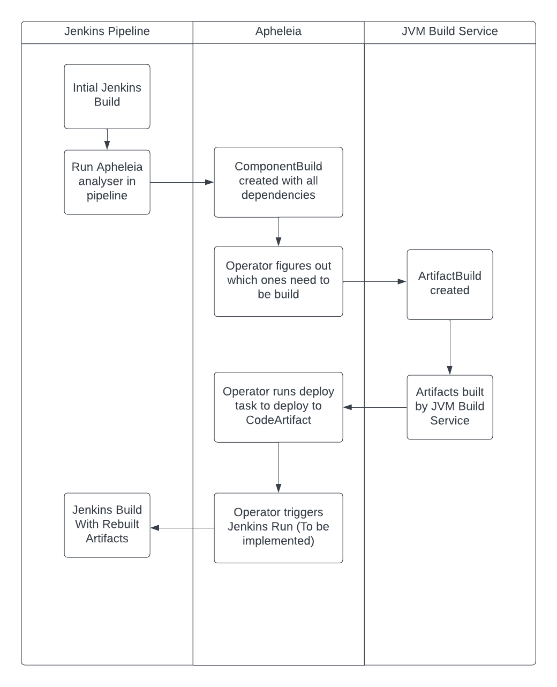

= Apheleia Documentation

This is a bit of a brain dump of everything I can think of before I go on PTO. Some
of this will end up in the JVM Build service docs, but I am putting it here so everything
is in one place for now.

== Basic Concepts

This section explains all the different parts of the system, its components, and
how data flows through the system.

=== JVM Build Service

The JVM Build Service is a service that attempts to automatically build 3rd party components, and deploy them to quay.io
in an image form. It also provides tools to work with these images, and serve them as standard maven artifacts.

==== Components

JVM Build Service consists of the following components:

JVM Build Service Operator::

This operator is responsible for orchestrating all parts of the build process. It watches user namespaces, and attempts to rebuilt objects when they are requested.

Cache::

The cache is created in every user namespace. It is responsible for caching Maven artifacts to speed up builds, and also transforming artifacts to include tracking data. All dependency rebuilds are configured to only get their artifacts from the cache.

Build Request Processor::

This is a Java + Quarkus CLI tool that provides a host of different functionalities. This is packaged up into an image, and then run in different parts of various pipelines by the operator.
+
In essence any custom logic that is needed in a pipeline goes in here, and then the operator will invoke it with the correct arguments. This is a single multitool rather than individual functions as experience has shown this is a lot easier to manage.

Builder Images::

The builder images are maintained at the https://github.com/redhat-appstudio/jvm-build-service-builder-images/[builder images repository].

Build Data Repository::

https://github.com/redhat-appstudio/jvm-build-data[This repository] contains information on how to build dependencies, and where their source code is located. For more information see <<build_data_repo>>.

==== CRDs

The JVM Build service provides the following CRDs. All CRDs are located in the https://github.com/redhat-appstudio/jvm-build-service/tree/main/deploy/crds/base[JVM Build Service repo]. They are generated from goang objects that reside https://github.com/redhat-appstudio/jvm-build-service/tree/main/pkg/apis/jvmbuildservice/v1alpha1[here].

===== ArtifactBuild

This represents a request to rebuild an artifact. Creating this object will kick off the JVM Build Service rebuild process. We should have one of these objects for every upstream GAV we want to rebuild.

These have the following states.

ArtifactBuildNew::

Object has just been created.

ArtifactBuildDiscovering::

The JVM Build Service is running a discovery pipeline to determine where the source code for this artifact is located.

ArtifactBuildMissing::

We failed to find the source code location. See <<missing_artifacts>> for information on how to fix this.

ArtifactBuildFailed::

The build failed. See <<failed_builds>> for information on how to fix this.

ArtifactBuildComplete::

The build was a success.

===== DependencyBuild

This represents a repository + tag combination we want to build. These are created automatically by the JVM Build Service Operator after it has looked up how to build.

Once these have been created the operator first runs a 'discovery' pipeline, that attempts to figure out how to build the repo, which both examines the code base, and also pulls in build information from <<build_data_repo>>. The result of
this is a list of build recipes that the operator will attempt one after the other. This object has the following states:

DependencyBuildStateNew::

The object has just been created.

DependencyBuildStateAnalyzeBuild::

The operator is running a pipeline to attempt to discover how to build the repository.

DependencyBuildStateBuilding::

A build pipeline is running.

DependencyBuildStateComplete::

The build was a success.

DependencyBuildStateFailed::

All attempts to build this repository have failed. For instructions on how to fix this see <<failed_builds>>.

DependencyBuildStateContaminated::

This state means that the build was a success, but community artifacts were shaded into the output of the build. The operator
will attempt to fix this automatically, by creating new `ArtifactBuild` objects for everything that was shaded into the output.
Once these have completed the build is automatically retried. A good example of this is the Netty build, which gets contaminated
by JCTools. If these artifact builds fail then the `DependencyBuild` will stay in this state indefinitely.

===== RebuiltArtifact

This represents a GAV that has been built and deployed to the image repo. It is basically just for internal bookkeeping
purposes.

===== JBSConfig

This object is used to configure all aspects of the JVM Build Service. For more information on the options it provides see <<config_options>>. The creation of this object is what triggers the creation of the Cache deployment for the namespace,
and is required for any rebuilds to happen in a given namespace.

===== SystemConfig

This is a singleton object that configures the JVM Build System. The main configuration it provides is the builder images to use. At present Apheleia is using the standard builder images from the https://github.com/redhat-appstudio/jvm-build-service/blob/main/deploy/operator/config/system-config.yaml[JVM Build Service Repo] merged with information from the https://github.com/redhat-appstudio/jvm-build-service-builder-images/blob/main/image-config.yaml[Builder Image Repo], however this can be overridden if required by modifying the `SystemConfig`.

=== Apheleia

==== Components

Apheleia consists of the following components:

Apheleia Operator::

This operator is responsible for orchestrating the additional workflows required by the RHOSAK team. In particular it will:
- Reconcile on `ComponentBuild` objects and turn them into `ArtifactBuild` objects that can be built by the JVM build service.
- Watch the state of `ArtifactBuild` objects and deploy the results to a Maven repository when everything has been built.

Apheleia Processor::
+
This is a Java + Quarkus CLI tool that provides a multiple functions. At present it supports the following commands:
+
*analyse*
+
This runs in the Jenkins pipeline, analyses the output of a build, and creates a `ComponentBuild` resource on the cluster that kicks off the build process.
+
*deploy*
+
This is run by the Operator as a Tekton task, although it can be run manually. This will
deploy all built artifacts in the namespace to an AWS CodeArtifact repo.
+
*download-sources*
+
This will download all the sources from a `ComponentBuild` into a single `.tar.gz` file.
+
For full details on the parameters it supports see the built-in usage help.

==== CRDs

ComponentBuild::

This CRD represents the dependencies of a git commit, it consists of a repo + tag/commit pair that identifies the relevant build, as well as a list of identified dependencies.
+
The Aphelelia operator looks at this list of dependencies and will attempt to build all of them from source, once this is complete it will deploy them to a maven repository.

== Installation

=== System Installation

Installation on a cluster can be achieved by using the following command:

```
./deployment/deploy.sh
```

This same command can also be used to update the server if the relevant resources have been
updated in the `deployment` directory. This command will do the following:

Install Openshift Pipelines::

This is managed by `deployment/tekton`. It simply creates a subscription to the  `pipelines-1.8` operator. There should be no need to change this.

Install the JVM Build Service::

This is controlled by `deployment/build-operator`. It references resources from the JVM Build service repo, defined by a specific commit. Every time code is committed to `main` in this repo new images are built automatically. These images are tagged under the git sha, so updating the service is a case of updating from the old git sha to the new commit.
+
*Example of how to update the JVM Build Service*
+
An example of the `kustomization.yaml` file is shown below:
+
```
resources:
- https://github.com/redhat-appstudio/jvm-build-service/deploy/crds/base?ref=2501bc0fa9c4e7ee135263bb9dc43d50a65a0e98
- https://github.com/redhat-appstudio/jvm-build-service/deploy/operator/base?ref=2501bc0fa9c4e7ee135263bb9dc43d50a65a0e98
- https://github.com/redhat-appstudio/jvm-build-service/deploy/operator/config?ref=2501bc0fa9c4e7ee135263bb9dc43d50a65a0e98

images:
  - name: hacbs-jvm-operator
    newName: quay.io/redhat-appstudio/hacbs-jvm-controller
    newTag: 2501bc0fa9c4e7ee135263bb9dc43d50a65a0e98

apiVersion: kustomize.config.k8s.io/v1beta1
kind: Kustomization
```
+
To update to a newer version I need to find the commit that I want to update to in the JVM Build service repo, and then replace all four instances of `2501bc0fa9c4e7ee135263bb9dc43d50a65a0e98` with the new commit, then run `deploy.sh` again.
+
WARNING: The images reference look a lot like we are referencing an image by its hash, but it is actually a tag that matches a git commit. Every image is built with a tag that matches the commit it was built from.

Deploy the Aphelia CRDS::

This is managed by the `deploy/crds` directory. These CRDs must not be edited directly. If you have made changes to the golang objects that represent the cluster state, you will need to also generate new CRDS, to do this see the section <<generate_crds>>.

=== Namespace Setup

Once the system is installed we can do per-namespace setup. There are 3 parts to this:

. Create the Namespace
. Setup the Secrets
. Install the JVM Build Service Objects

For these examples we will use a namespace called `kas-fleetshard`.

WARNING: Due to a current limitation in JVM build service you need to create the secret before setting up the namespace. This will be fixed at some point in the future.

==== Create the Namespace

`oc create namespace kas-fleetshard`

==== Create the Secrets

Apheleia needs the following secrets in each namespace in order to function correctly.

aws-secrets::

This secret is used by the deploy task to authenticate against AWS CodeArtifact. It requires an AWS access key and AWS secret key. These should be from a service account and not a personal account.

This account needs the following permissions:

```
"codeartifact:Describe*",
"codeartifact:Get*",
"codeartifact:List*",
"codeartifact:ReadFromRepository"
"codeartifact:DeletePackageVersions",
"codeartifact:DescribePackageVersion",
"codeartifact:DisposePackageVersions",
"codeartifact:TagResource",
"codeartifact:PutPackageOriginConfiguration",
"codeartifact:UntagResource",
"codeartifact:DescribeRepository",
"codeartifact:DescribeDomain",
"codeartifact:PutPackageMetadata",
"codeartifact:UpdatePackageVersionsStatus",
"codeartifact:PublishPackageVersion",
```

You can create the secret with the following command:

```
kubectl create secret generic aws-secrets --from-literal=access-key=<AWS_ACCESS_KEY> --from-literal=secret-key=<AWS_SECRET_KEY>
```

jvm-build-image-secrets::

This secret is used to authenticate against the https://quay.io repository that is used to store the rebuilt artifacts. If you have done a docker login with an account that has
access you can create the secret as follows:

```
kubectl create secret generic jvm-build-image-secrets --from-file=.dockerconfigjson=$HOME/.docker/config.json --type=kubernetes.io/dockerconfigjson
```

WARNING: This will include everything in your `$HOME/.docker/config.json` file, you should make sure you don't have additional repositories mentioned in this file that you don't want saved to the cluster.

jvm-build-git-secrets::

This secret is used to authenticate against private git repositories. You can create
it as follows:

```
kubectl create secret generic jvm-build-git-secrets --from-literal .git-credentials="
https://<GITLAB_USERNAME>:<GITLAB_TOKEN>@gitlab.cee.redhat.com/
"
```

==== Install the Config

To activate the namespace run:

```
./deployment/setup-namespaces.sh kas-fleetshard
```

WARNING: This config hard codes the quay.io user to `mk-ci-cd`. If you want a different user or repository you will need to update `deployment/namespace/config.yaml`. For full details of all config options see <<config_options>>. If you need to update the config run `setup-namespaces.sh` again after modifying the `config.yaml`.


== Users Guide

This section covers everything (hopefully) you need to know to perform builds with Aphelia.

=== Flow Overview



The basic flow is summarised in the image above. The Apheleia dependency analyser is placed into the Jenkins pipeline after the build step. It Analyses the build and creates a `ComponentBuild` with the results. If this has no community dependencies then it will exit with a zero exit code, otherwise it will be non-zero and fail the pipeline.

Once this `ComponentBuild` has been created the Apheleia operator will reconcile it. The operator will look at the dependencies, and attempt to create new `ArtifactBuild` objects to rebuild these dependencies. If the `ArtifactBuild` already exists then it will be linked to the existing object.

This then triggers the JVM Build Service to attempt to build these objects, once they are built (or fail) the Apheleia operator will update the `ComponentBuild`, with the state. Once all builds are complete it will run the deploy task to deploy everything, and then kick off a new Jenkins build (TODO: This is not implemented yet).

=== Viewing the ComponentBuild state

You can list the ComponentBuild objects using:

```
kubectl get componentbuild
```

To view the full details you can run:

```
kubectl get componentbuild <name> -o yaml
```

You will get output similar to the below:

```
apiVersion: apheleia.io/v1alpha1
kind: ComponentBuild
metadata:
  creationTimestamp: "2022-12-21T02:50:31Z"
  generation: 1
  name: 8210a253ee60e994319a414746e760
  namespace: test-jvm-namespace
  resourceVersion: "51445019"
  uid: 7ccdc760-842d-497a-8bbc-e29aedd562f4
spec:
  artifacts:
  - ch.qos.reload4j:reload4j:1.2.19
  - com.fasterxml.jackson.core:jackson-annotations:2.13.3
  - com.fasterxml.jackson.core:jackson-annotations:2.13.4
  - com.fasterxml.jackson.core:jackson-databind:2.13.4.2
  scmURL: test2
  tag: test1
status:
  artifactState:
    ch.qos.reload4j:reload4j:1.2.19:
      artifactBuild: reload4j.1.2.19-96fb23de
      done: true
    com.fasterxml.jackson.core:jackson-annotations:2.13.3:
      artifactBuild: jackson.annotations.2.13.3-745a8e63
      done: true
    com.fasterxml.jackson.core:jackson-annotations:2.13.4:
      artifactBuild: jackson.annotations.2.13.4-43f4590b
      done: true
    com.fasterxml.jackson.core:jackson-databind:2.13.4.2:
      artifactBuild: jackson.databind.2.13.4.2-50dca403 <1>
      done: true <2>
      failed: true <3>
  state: ComponentBuildFailed
```
<1> This is the name of the JVM Build service `ArtifactBuild` object.
<2> This indicates that the build has completed.
<3> This tells us the build has failed.

The state shows the current state of the artifacts, in particular the `done` flag will be true if they are completed,
and the `failed` flag will be set if the build failed.

=== Re-Running Builds [[rebuilding_artifacts]]

To rebuild an artifact you need to annotate the `ArtifactBuild` object with `jvmbuildservice.io/rebuild=true`. For example to rebuild the `zookeeper.3.6.3-8fc126b0` `ArtifactBuild` you would run the following command:

```
kubectl annotate artifactbuild zookeeper.3.6.3-8fc126b0 jvmbuildservice.io/rebuild=true
```

You can also use the `jvmbuildservice.io/rebuild=failed` annotation to rebuild only failed artifacts, for example the following command will retry all failed artifacts:

```
kubectl annotate artifactbuild --all jvmbuildservice.io/rebuild=failed
```

Generally when you are trying to fix a failure you will need to manually run the builds yourself.

=== Dealing With Failed Builds

In order to see why the build failed we need to look at the results from the JVM Build Service.

The first step is to look at the state of the corresponding `ArtifactBuild`. If we want to figure out why `jackson-databind`
failed above we would first execute the following command to view the ArtifactBuild state:

```
kubectl get artifactbuilds.jvmbuildservice.io jackson.databind.2.13.4.2-50dca403 -o yaml
```

We might get output as follows:

```
apiVersion: jvmbuildservice.io/v1alpha1
kind: ArtifactBuild
metadata:
  creationTimestamp: "2022-12-21T02:50:31Z"
  generation: 1
  name: jackson.databind.2.13.4.2-50dca403
  namespace: test-jvm-namespace
  ownerReferences: <1>
  - apiVersion: apheleia.io/v1alpha1
    kind: ComponentBuild
    name: 8210a253ee60e994319a414746e760
    uid: 7ccdc760-842d-497a-8bbc-e29aedd562f4
  - apiVersion: apheleia.io/v1alpha1
    kind: ComponentBuild
    name: f9606be9986d7cb2f50fd62d340a03
    uid: d68fcd4c-2180-411b-966e-b1358646343d
  resourceVersion: "51371901"
  uid: f11a4b7f-b19b-4e79-ab8f-392bff80e25f
spec:
  gav: com.fasterxml.jackson.core:jackson-databind:2.13.4.2
status:
  scm:
    scmType: git
    scmURL: https://github.com/FasterXML/jackson-databind.git <2>
    tag: jackson-databind-2.13.4.2
  state: ArtifactBuildFailed <3>

```
<1> `ComponentBuild` objects own the `ArtifactBuild` objects they reference. If every ComponentBuild is deleted then so will the artifact builds.
<2> This is the SCM information that was successfully discovered
<3> This tells us the current state. In this case the build has failed.

There are 2 main failure states we need to deal with, `ArtifactBuildMissing` and `ArtifactBuildFailed`.

=== Dealing With Missing Artifacts (`ArtifactBuildMissing`) [[missing_artifacts]]

If our build has ended up in this state then it means we need to add some SCM information into our build data repository.

There are three possible causes of this state:

- We could not figure out which repository the artifact comes from
- We could not map the version to a tag in this repository
- The pipeline failed for other reasons (e.g. network failure)

The pipeline will be named <artifact-build-name>-scm-discovery-<random-string>. To view the pipeline logs
you can do:

```
tkn pr list | grep jackson.databind.2.13.4.2-50dca403 <1>
tkn pr logs jackson.databind.2.13.4.2-50dca403-<discoveredid> <2>
```
<1> Find the pipeline name.
<2> Use the name from the first line to view the logs.

This may be helpful to diagnose exactly why it failed.

To fix missing SCM information we need to add additional information to the https://github.com/redhat-appstudio/jvm-build-data/tree/main/scm-info[build information repository]. Once this has been updated see the section on <<rebuilding_artifacts>> for instructions on how to re-run it which should see it resolve this information, and it should then move to state `ArtifactBuildBuilding` (and hopefully eventually to `ArtifactBuildComplete`).

NOTE: This may be added into a private build information repo, see <<private_build_data_repos>> for more info.

For further details on the structure and format of files within the jvm-build-data repository see https://github.com/redhat-appstudio/jvm-build-data

=== Dealing With Failed Builds [[failed_builds]]

To deal with failed builds we need to look at the build logs, figure out why it failed, and attempt to fix it.

Unfortunately this can be complex.

First we need to identify the correct `DependencyBuild` object, run `kubectl get dependencybuilds` to list them,
and pick the one you are interested in out of the list. Generally each `DependencyBuild` will have multiple pipeline
runs, named using the pattern `<dependency-build-name>-build-<n>`. You can view the logs using the `tkn pr logs <name>`
command, e.g.:

```
tkn pr logs e8f6f6126f222a021fedfaee3bd3f980-build-0
```

The builds are performed lowest JDK to highest JDK, although some JDKs may be skipped if the analyser can determine they
are not relevant. If a build has failed because of a JDK version issue it may just be you need to look at a later build.

==== Unknown Build Systems

If there are no builds at all then this means the analyser could not find a build file to use. The only real way to fix
this at the moment is to create a fork of the repo, change the build system to Maven, and build from the fork.

An example of this is at https://github.com/jvm-build-service-code/cs-au-dk-dk.brics.automaton.
The 1.11-8 release had no build file, so the project was forked and one added. This was then added to the SCM information at https://github.com/redhat-appstudio/jvm-build-data/blob/30a00905314ca5bf20d653af1a59c39c93b9aadb/scm-info/dk/brics/_artifact/automaton/scm.yaml#L6.

==== Tweaking Build Parameters

It is also possible to tweak build parameters to get them to pass via a `build.yaml` file in the build
data repository. For further details on the structure and format see https://github.com/redhat-appstudio/jvm-build-data

== Placeholder Section Heading

Everything after this is a placeholder

== The Build Data Repository [[build_data_repo]]

=== Private Build Data Repositories [[private_build_data_repos]]


=== Generating the CRDS [[generate_crds]]

To generate the CRDs you must run `make generate` after modifying the relevant go objects. These changes should be committed together.


=== JVM Build Service Config Options [[config_options]]

TODO:
